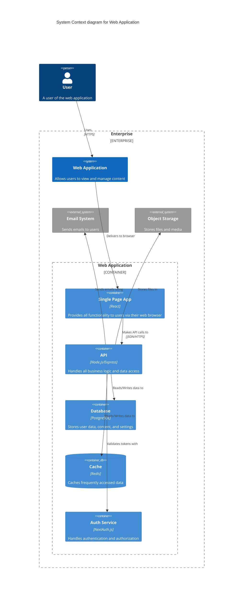

# 


This document demonstrates various Markdoc features and syntax elements.



This is a note callout



This is a warning callout



This is an error callout



This is a tip callout


## Basic Markdown Features

### Text Formatting
[Explore the syntax](/docs/syntax)

# My Document 



## Introduction 

This is the introduction.

## Features 

These are the features.




Description of feature 1.



Description of feature 2.
Description of feature 2.
Description of feature 2.
Description of feature 2.
- Description of feature 2.






This paragraph demonstrates **bold text**, *italic text*, ~~strikethrough~~, and `inline code`.

### Lists

Unordered list:
- Item 1
- Item 2
  - Nested item 2.1
  - Nested item 2.2
- Item 3

Ordered list:
1. First item
2. Second item
3. Third item

### Blockquotes

> This is a blockquote.
> It can span multiple lines.

### Code Blocks

```javascript
function greet(name) {
  console.log(`Hello, ${name}!`);
}
```

### Tables

| Column 1 | Column 2 | Column 3 |
|----------|----------|----------|
| Row 1, Col 1 | Row 1, Col 2 | Row 1, Col 3 |
| Row 2, Col 1 | Row 2, Col 2 | Row 2, Col 3 |


### Mermaid
# Mermaid Diagram Examples

## 1. Flowchart


## 2. Sequence Diagram


## 3. Class Diagram


## 4. State Diagram
(This remains unchanged if it was correct in the original)

## 5. Entity Relationship Diagram


## 6. Gantt Chart


## 7. Pie Chart


## 8. User Journey Diagram


## Markdoc-Specific Features

### Variables

The title of this document is: 

### Functions

Today's date is: 


### Partials


### Custom Tags


This is a warning callout.



This is a check callout.



* Fruit
* Vitamin
---
* Apple
* Vitamin C
---
* Banana
* Vitamin B6


### Annotations

This text has an annotation. It appears at the end of the sentence.


### Anchors and Internal Links

## Section with Anchor 

[Link to Custom Anchor](#custom-anchor)

### External Links

[Markdoc Documentation](https://markdoc.dev)

### Partials


# System Architecture

## Context Diagram
This diagram shows the high-level system context:




## Conclusion

This document showcases various Markdoc features. Refer to the [official Markdoc documentation](https://markdoc.dev) for more details on each feature.
